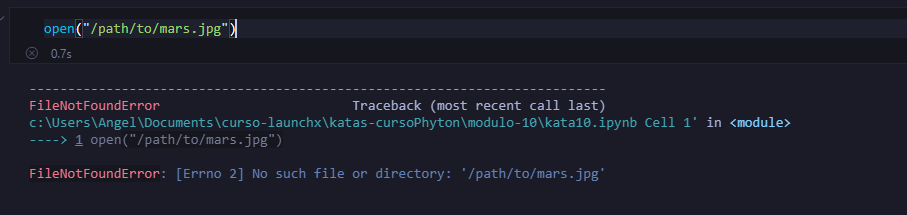
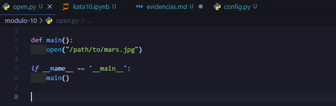
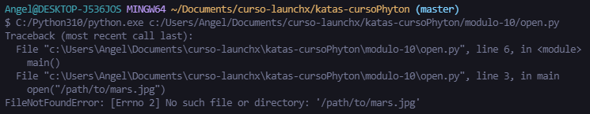
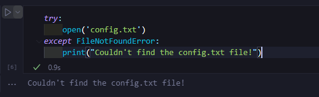
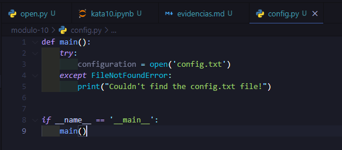

# Uso de tracebacks para buscar errores

## Tracebacks

Si intentamos en un notebook, abrir un archivo inexistente sucede lo siguiente:

Intenta crear un archivo de Python y asígnale el nombre open.py, con el contenido siguiente:

Ejecútala con Python y podrás comprobar el siguiente mensaje de error:

## Controlando las excepciones

### Try y Except de los bloques

Vamos a usar el ejemplo de navegador a fin de crear código que abra archivos de configuración para la misión de Marte. Los archivos de configuración pueden tener todo tipo de problemas, por lo que es fundamental notificarlos con precisión cuando se presenten. Sabemos que, si no existe un archivo o directorio, se genera FileNotFoundError. Si queremos controlar esa excepción, podemos hacerlo con un bloque try y except:

Vamos a crear un archivo de Python denominado config.py. El archivo tiene código que busca y lee el archivo de configuración del sistema de navegación:

Probaremos actualizando la función main(). Ahora volvemos a ejecutar el código en el mismo lugar donde existe el archivo config.txt con permisos incorrectos:

 y mostrando el error")

Vamos a corregir este fragmento de código para abordar todas estas frustraciones. Revertiremos la detección de FileNotFoundError y luego agregamos otro bloque except para detectar PermissionError: